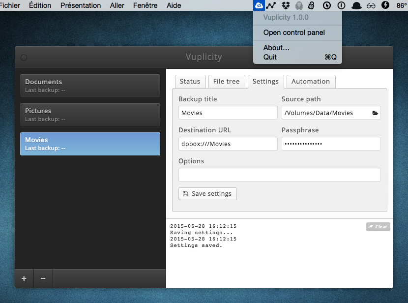

A cross-platform GUI for Duplicity backups, powered by Atom Electron.

> :warning:
>
> [](http://unmaintained.tech/)
>
> I had a lot of problems with `duplicity` lately (frequent crashes on my OSX system, corrupted data) that led me to
> not use it anymore (nor Vuplicity) for my backups.
> 
> I think that being a user of the product is a crucial point for a maintainer to do a great work, so that's why I am afraid I will not ~~have~~ take time to work on Vuplicity in the future.
> 
> That being said, the [license](LICENSE) allows you to do whatever you want with the existing code and UI; so, if you are still interested in the project, please feel free to fork it / do stuff in the code / adjust things or rebuild entire features // it's up to you.
>
> Thanks!

---

* [Features](#features)
* [Download](#download)
* [Development installation](#development-installation)
* [Todos](#todos)
* [Changelog](#changelog)
* [License](#license)
* [Credits](#credits)

## Features



The GUI works directly with Duplicity by sending shell commands, so you can use your existing backups and / or create new ones independently.

#### Backup status

Check the status of a backup, start it manually, or restore its content.

#### Configuration

Fill the source path, destination URL, passphrase, and custom CLI options if needed.

You can add several backup configurations on the left panel.

The configuration uses one JSON file per backup, stored in `$HOME/.vuplicity`.

#### File tree

Check the content of the backup, or choose to restore a single file.

#### Scheduler

Schedule the backup by choosing a delay or a time, and the days when you want it to be applied (in the week or month).

You may also combine multiple schedules (for instance, one incremental backup each day at 2:00am, and one full backup once a month).

## Download

*[Duplicity](http://duplicity.nongnu.org/) is not shipped with the app.*

*You have to install it first, and ensure that the `duplicity` command is included in your global `$PATH` to allow the app to access it.*

### OSX

You can download the last version of the app on the [Releases](https://github.com/johansatge/vuplicity/releases) page.

### Linux & Windows

**Help needed !**

For now no binaries are available, because I didn't run advanced tests on those platforms.

If you want to get involved, feel free to follow the installation steps above, and test the project by yourself.

Comments are very welcome on the [Issues](https://github.com/johansatge/vuplicity/issues) page.

## Development installation

### Installation steps

**1.** Install [node.js](https://nodejs.org/) and [npm](https://github.com/npm/npm) if needed

**2.** Install [Atom Electron](http://electron.atom.io/) if needed (by using `npm install -g electron-prebuilt`)

**3.** Install [Grunt](http://gruntjs.com/) if needed (by using `npm install -g grunt`)

**4.** Get the project and its dependencies

```bash
git clone https://github.com/johansatge/vuplicity.git
npm install
cd vuplicity/app && npm install
```

### Development

Run the application:

```bash
grunt run
```

The following options are available, if needed:

| Option | Usage |
| :--- | :--- |
| `grunt run --devtools` | Opens the devtools with the control panel |
| `grunt run --configpath=/Users/johan/.vuplicity-dev` | Overrides the path of the config |

Build the application for the desired platform:

```bash
grunt build --platforms=darwin,linux,win32
```

Watch for SASS updates:

```bash
grunt sass
```

## Todos

Planned features are listed in the [Issues](https://github.com/johansatge/vuplicity/issues).

## Changelog

| Version | Date | Notes |
| --- | --- | --- |
| `1.0.1` | July 2nd, 2015 | - Various CSS fixes<br>- Sanitizes history when doing a backup<br>- Fixes app icon on OSX |
| `1.0.0` | June 26th, 2015 | Initial version |

## License

This project is released under the [MIT License](LICENSE).

## Credits

* [Atom Electron](http://electron.atom.io)
* [Font Awesome](http://fontawesome.io)
* [Glob](https://github.com/isaacs/node-glob)
* [Later](https://github.com/bunkat/later)
* [yargs](https://github.com/bcoe/yargs)
* [electron-packager](https://github.com/maxogden/electron-packager)
* [moment](http://momentjs.com/)
